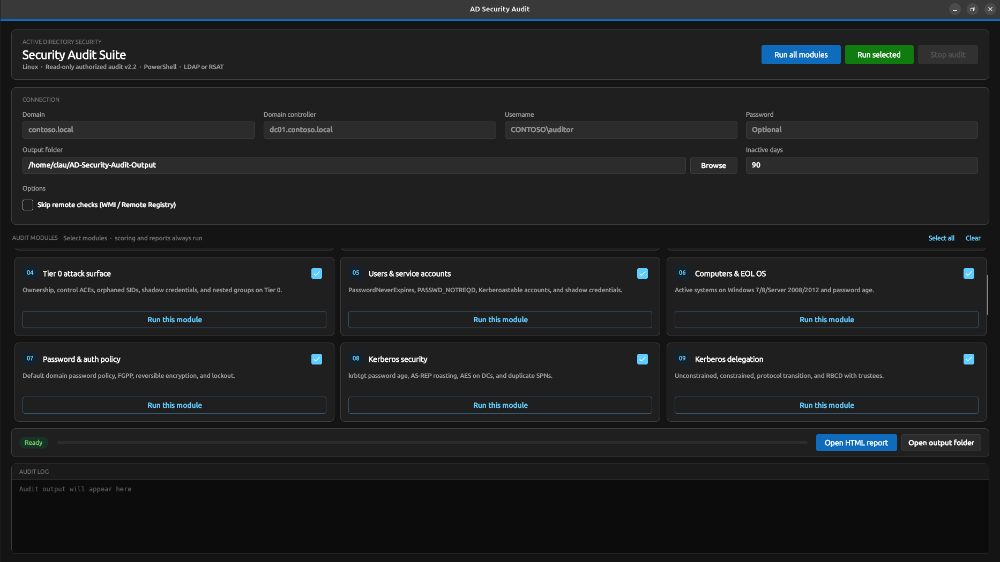

# AD Security Audit (ADSA)

Read-only Active Directory security assessment for **Windows** and **Linux**. Use only where you have explicit written authorization.

ADSA runs 23 audit modules (ANSSI / CIS / Microsoft baselines) and writes HTML, CSV, and JSON reports with findings, remediation steps, and quick wins.

**Version:** 2.2.0



---

## Quick start

### 1. Clone the repo

```bash
git clone https://github.com/ClaudiuJitea/ADSA.git
cd ADSA
```

### 2. Run the audit

Replace `contoso.local` and `dc01.contoso.local` with your domain and domain controller.

**Linux — desktop app**

```bash
chmod +x ./run-gui.sh ./run-audit.sh
./run-gui.sh
```

**Linux — command line**

```bash
./run-audit.sh -Domain "contoso.local" -Server "dc01.contoso.local"
```

**Windows — desktop app**

Double-click `run-gui.bat`, or run:

```bat
powershell -File .\run-gui.ps1
```

**Windows — command line**

```bat
run-audit.bat -Domain "contoso.local" -Server "dc01.contoso.local"
```

**PowerShell only** (no .NET build required)

```bash
pwsh -NoProfile -File ./Invoke-ADSecurityAudit.ps1 -Domain "contoso.local" -Server "dc01.contoso.local"
```

### 3. Open the report

Reports are written to the `Output` folder (or the path you chose in the GUI):

- `AD-Security-Audit-Summary.html` — main report (open this first)
- CSV exports and `AD-Security-Audit-Findings.json`

---

## Desktop app

1. Enter domain, domain controller, and credentials (optional).
2. Choose an output folder.
3. Select modules or keep all selected.
4. Click **Run all modules** or **Run selected**.
5. Open `AD-Security-Audit-Summary.html` when finished.

---

## Requirements

- Written permission to query the target domain
- Network access to a domain controller (LDAP 389 / LDAPS 636)
- **PowerShell 7** (`pwsh`) on the machine running the audit
  - Windows: falls back to Windows PowerShell 5.1 if `pwsh` is missing
  - Linux: [install PowerShell 7](https://learn.microsoft.com/en-us/powershell/scripting/install/installing-powershell-on-linux)
- Desktop session for the GUI (not headless SSH)
- **.NET 8 SDK** only if you build from source — [download](https://dotnet.microsoft.com/download/dotnet/8.0)

Optional on Windows: RSAT Active Directory module (uses `Get-AD*` when available; otherwise LDAP).

---

## Build from source

```bash
dotnet restore ./AD-Security-Audit.sln
dotnet build ./AD-Security-Audit.sln -c Release
```

Publish self-contained binaries to `Publish/`:

**Linux**

```bash
dotnet publish ./GUI/ADSecurityAuditGUI.csproj -c Release -r linux-x64 --self-contained true -o ./Publish/linux-x64-gui
dotnet publish ./CLI/ADSecurityAuditCLI.csproj -c Release -r linux-x64 --self-contained true -o ./Publish/linux-x64
```

**Windows**

```bat
dotnet publish .\GUI\ADSecurityAuditGUI.csproj -c Release -r win-x64 --self-contained true -p:OutputType=WinExe -o .\Publish\win-x64-gui
dotnet publish .\CLI\ADSecurityAuditCLI.csproj -c Release -r win-x64 --self-contained true -o .\Publish\win-x64
```

---

## Common options

| Parameter | Description | Default |
| --- | --- | --- |
| `-Domain` | Domain FQDN or NetBIOS name | required |
| `-Server` | Domain controller hostname or IP | same as Domain |
| `-OutputPath` | Report directory | `Output` |
| `-Modules` | Comma-separated module IDs | all |
| `-InactiveDays` | Inactive user/computer threshold | `90` |
| `-SkipRemoteChecks` | Skip WMI / Remote Registry on DCs | off |
| `-FailOnSeverity` | Exit code `2` on Critical/High/etc. | `None` |

Example — run two modules and fail CI on Critical findings:

```bash
pwsh -File ./Invoke-ADSecurityAudit.ps1 -Domain "contoso.local" -Server "dc01" -Modules "TierZero,CertificateServices" -FailOnSeverity Critical
```

Edit `Config/AuditConfig.json` for baselines (password length, LDAPS preference, etc.).

---

## What gets checked

23 modules cover domain/forest settings, domain controllers, privileged groups, Tier 0 attack surface, Kerberos, delegation, GPO, AD ACLs, AD CS (ESC1–ESC13), LAPS, trusts, hybrid identity, and more. Risk scoring and HTML/CSV/JSON reporting always run at the end.

---

## Tests

Run without a live domain:

```bash
pwsh -File ./Tests/Invoke-AuditEngineTests.ps1
```

---

## Legal

This tool performs **authorized, read-only** directory queries. Do not run it against environments you do not own or have written permission to assess. Findings describe configuration and attack-surface conditions; the engine does not modify the directory.
